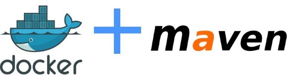

# Using Docker from Maven and Maven from Docker




[Codefresh status](http://codefresh.io): []( https://g.codefresh.io/repositories/kostis-codefresh/docker-maven-comparison/builds?filter=trigger:build;branch:master;service:5b17f311f38e9275624153a3~basic)

This repository holds the code mentioned in the Codefresh blog post "Using Docker from Maven and Maven from Docker"

It consists of 4 individual projects mentioned in the article

1. A Java project that uses the [Maven spotify plugin](01-using-spotify-plugin/pom.xml#L184)
1. A Java project that uses the [Fabric8 Maven plugin](02-using-fabric8-plugin/pom.xml#L183) (also runs integration tests)
1. A Java project with a [Multi-stage dockerfile](03-multistage/Dockerfile) that runs Maven from within Docker
1. The same multi-stage Java projects with a [YAML build file for Codefresh](codefresh.yml)

## Instructions for each project


### Maven Spotify plugin

To build the project
```
cd 01-using-spotify-plugin
mvn package
```

This command will create a Docker image

### Maven Fabric8 plugin

To build the project and run integration tests
```
cd 02-using-fabric8-plugin
mvn verify
```

This command will 
1. compile and the code create a Docker image
1. launch the docker image and run integration tests against it

### Multi-stage build

To build the project and run unit tests
```
cd 03-multistage
docker build -t my-java-app .
```

This command will 
1. Download a Maven docker image and use it to compile the code and run unit tests
1. Keep the WAR file produced it will place it in a Tomcat Docker image

### Multi-stage build (with Codefresh)

[Create a Codefresh account](https://codefresh.io/docs/docs/getting-started/create-a-codefresh-account/) and use the [provided build yaml file](codefresh.yml).

```
version: '1.0'
steps:
  build_image:
    type: build
    description: Building the image...
    image_name: docker-maven-comparison
    working_directory: ./04-codefresh
    tag: develop
  build_image_with_tests:
    type: build
    description: Building the Test image...
    image_name: maven-integration-tests
    working_directory: ./04-codefresh
    dockerfile: Dockerfile.testing
  integration_tests:
    type: composition
    title: Launching QA environment
    description: Temporary test environment
    working_directory: ${{main_clone}}
    composition:
      version: '2'
      services:
        app:
          image: ${{build_image}}
          ports:
           - 8080
    composition_candidates:
      test_service: 
        image: ${{build_image_with_tests}}
        links:
          - app
        command: bash -c '/usr/bin/wait-for-it.sh -t 20 app:8080 -- mvn verify -Dserver.host=app'
```


Once build this [Codefresh YAML](https://codefresh.io/docs/docs/codefresh-yaml/what-is-the-codefresh-yaml/) will

1. Create a multi-stage Docker image with the war file (based on Tomcat) also running unit tests
1. Create a Maven image that holds the integration tests
1. Launch the tomcat image and run the integration tests against it (using [wait-for-it.sh](https://github.com/vishnubob/wait-for-it) as well)


